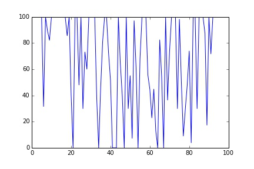
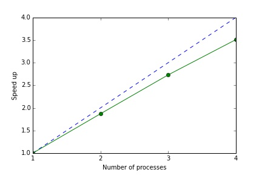
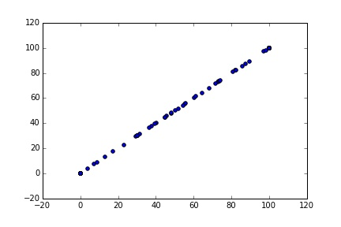
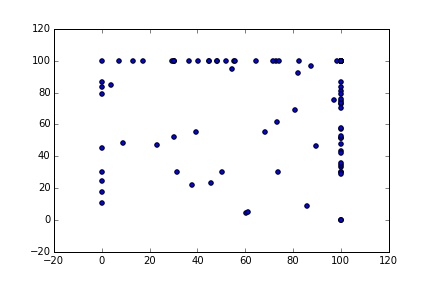
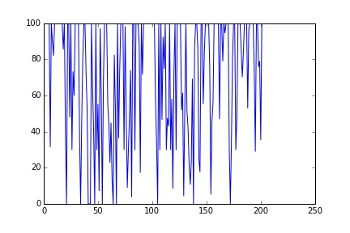

These days CPUs are not getting any faster: computers just have more of them. The average desktop has 4 CPU cores, but by default most code running in Python (or Matlab etc.) will only be using one. More importantly, high performance computing now relies on massive supercomputers, like the [ANU NCI]() with around 60,000 cores. Taking advantage of these multi-core systems usually requires some additional programming effort. 

# Processes and threads

There are two forms of parallel computing: shared memory (i.e., threads) and message passing (i.e., processes). With threading, multiple CPU cores operate on shared input data. With processes, each CPU core runs an essentially independent task, requiring its own copy of the input data. 

Message passing involves performance overheads - as such it is more suited to large complicated computing jobs. Shared memory is fast but is limited by concurrency problems (where different threads try to access the same data at the same time) - as such it is suited to running large numbers of very simple jobs (i.e., running a loop in parallel).   

Within Python, multiple processes can be managed by the `multiprocessing` module.  Python doesn't allow for threading based parallelization, due to the Global Interpreter Lock (GIL). However, multi-threading can be achieved with Cython via OpenMP (a threading platform for C). Here, we look at processes. Threads are discussed in this post.

# A simulation model

Simulation models are a good candidate for process based parallelization. Monte carlo simulation is so called 'embarrassingly parallel': a large Monte carlo run can simply be divided into 'chunks' and run on separate cores, with the results being combined at the end.

Here is a simple example. Suppose we want to simulate the storage levels of a reservoir, which follows the rule

$$  S_{t+1} = min\{S_t + I_{t+1} - W_t, K\}$$ 

$$  I_{t+1} \sim \max \{N(\mu, \sigma^2) , 0\}$$ 

$$  W_{t} = min \{ S_t, \bar S\}$$ 

$$  0 < S_t, W_t, \bar S < K $$ 

where \\(S_t\\) is the storage volume at time \\(t\\), \\(I_{t+1}\\) the stochastic inflow and  \\(W_t\\) the storage release (i.e., withdrawal).

Below is a pure python implementation in the file `multicore_storage_sim.py` (of course this would run much faster if implemented in [Cython]()):


import numpy as np

def simulate(K, mu, sig, Sbar, T):
    
    S = np.zeros(T+1)
    W = np.zeros(T+1)
    I = np.zeros(T+1)
    S[0] = K

    for t in range(T):
        W[t] = min(S[t], Sbar)    
        I[t+1] = max(np.random.normal(mu, sig), 0)
        S[t+1] = min(S[t] - W[t] + I[t+1], K)

    return S


Lets make sure it works


from multicore_storage_sim import simulate
from matplotlib import pyplot as plt
S = simulate(100, 70, 70, 70, 100)
plt.plot(S)


<figure>
	
</figure>

Now lets time it in `IPython`


%timeit simulate(100, 70, 70, 70, 2000000)
1 loops, best of 3: 3.47 s per loop


# Using multiprocessing

To run this in parallel we need to use the [multiprocessing](https://docs.python.org/2/library/multiprocessing.html) module. Here we have two options for passing messages between processes: `Queues` and `Pipes` (see the [docs](https://docs.python.org/2/library/multiprocessing.html)). We use `Queues` because they tend to be more stable (`Pipes` are faster but less reliable).

First, we modify our function so that it can return its output via a `Queue` instance:


import numpy as np

def simulate(K, mu, sig, Sbar, T, multi=False, que=0):
    
    S = np.zeros(T+1)
    W = np.zeros(T+1)
    I = np.zeros(T+1)
    S[0] = K

    for t in range(T):
        W[t] = min(S[t], Sbar)    
        I[t+1] = max(np.random.normal(mu, sig), 0)
        S[t+1] = min(S[t] - W[t] + I[t+1], K)

    if multi:
        que.put(S)
    else:
        return S


The code for generating multiple processes then looks like this


from multiprocessing import Process
from multiprocessing.queues import Queue

def multi_sim(CORES=2, T=100):
    
    results = []
    ques = [Queue() for i in range(CORES)]
    args = [(100, 70, 70, 70, int(T/CORES), True, ques[i]) for i in range(CORES)]
    jobs = [Process(target=simulate, args=(a)) for a in args]
    for j in jobs: j.start()
    for q in ques: results.append(q.get())
    for j in jobs: j.join()
    S = np.hstack(results)

    return S


For each process we create both a: `Queue` object (to receive the outputs) and an argument tuple. To create a process we call `multiprocessing.Process`,  passing the target function `simulate` and the arguments.

We execute processes by calling the `start()` method. Note this is non-blocking: the interpreter won't wait for a process to complete before executing the next instruction. To force the interpreter to pause until a process finishes we call the `join()` method. We collect the results from the `Queues` with the `get()` method. Finally, we stack the results into a single array. 

Note that the target needs to be a Python function. Cython code can run in multiple processes, but only  within a Python 'wrapper' function. Be aware though, that converting large Python numpy arrays into Cython memoryviews can involve additional overhead. Where this becomes a problem, you have two options: don't use memoryviews (adopt the older [Cython numpy array syntax](http://docs.cython.org/0.14/src/tutorial/numpy.html)) or try threads (see here).

Anyway, lets time it in `IPython`


from multicore_storage_sim import multi_sim
%timeit multi_sim(2, 2000000)
1 loops, best of 3: 1.85 s per loop
%timeit multi_sim(3, 2000000)
1 loops, best of 3: 1.27 s per loop
%timeit multi_sim(4, 2000000)
1 loops, best of 3: 988 ms per loop


So with two cores we get just under a two times speed up. With 4 cores we get a speed up of around 3.5. 

<figure>
	
</figure>

The message passing overhead is essentially fixed (in this case around 0.12 seconds) so the speed up declines slightly as we increase the number of jobs. Of course the message passing overhead will depend on the application: ideally the size of the input/output data is small relative to the complexity of the jobs.

In practice, messaging passing under `multiprocessing` can lead to stability problems, even with `Queues`. Below is a useful wrapper for `Queue` objects that handles exceptions. I've found this code all but eliminates message passing errors.


def retry_on_eintr(function, *args, **kw):
    while True:
        try:
            return function(*args, **kw)
        except IOError, e:            
            if e.errno == errno.EINTR:
                continue
            else:
                raise    

class RetryQueue(Queue):

    def get(self, block=True, timeout=None):
        return retry_on_eintr(Queue.get, self, block, timeout)


Now we can just use the `RetryQueue` class in place of `Queue`

Cool so all done? Not quite. If we look at the results from the two processes, we'll see a problem 


S = multi_sim(2, 200)
plt.scatter(S[0:101], S[101:202])


<figure>
	
</figure>

Uh oh, the two series are identical. The problem is that each process gives the same 'seed' to the random number generator. So both have the same inflow shock series, and given the same initial state the same path for storage levels. To fix this we need to set the seed within each process using `np.random.seed()`. 


def simulate(K, mu, sig, Sbar, T, multi=False, que=0, jobno=0):
    
    np.random.seed(jobno)

    S = np.zeros(T+1)
    W = np.zeros(T+1)
    I = np.zeros(T+1)
    S[0] = K

    for t in range(T):
        W[t] = min(S[t], Sbar)    
        I[t+1] = max(np.random.normal(mu, sig), 0)
        S[t+1] = min(S[t] - W[t] + I[t+1], K)

    if multi:
        que.put(S)
    else:
        return S

def multi_sim(CORES=2, T=100):
    
    results = []
    ques = [RetryQueue() for i in range(CORES)]
    args = [(100, 70, 70, 70, int(T/CORES), True, ques[i]) for i in range(CORES)]
    jobs = [Process(target=simulate, args=(a)) for a in args]
    for j in jobs: j.start()
    for q in ques: results.append(q.get())
    for j in jobs: j.join()
    S = np.hstack(results)

    return S




from multicore_storage_sim import multi_sim
S = multi_sim(2, 200)
plt.scatter(S[0:101], results[101:202])
plt.plot(S)


<figure>
	
</figure>

<figure>
	
</figure>

Much better, now we have 200 unique samples.

